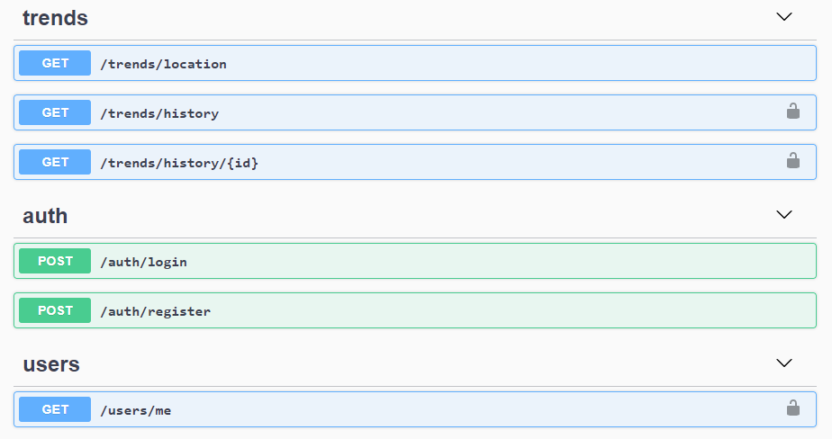
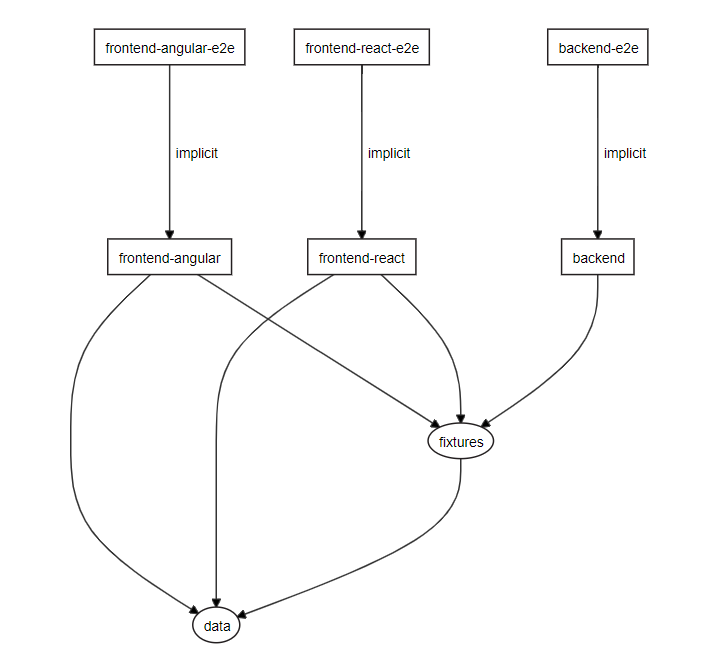

[](https://github.com/Nalhin/TrendingNearMe/actions)
[](https://codecov.io/gh/Nalhin/TrendingNearMe)

# Trending Near Me

Visualize Twitter trends based on location.

## Table of contents

- [Description](#description)
- [Features](#features)
- [Presentation](#presentation)
- [Technology Stack](#technology-stack)
- [Project Architecture](#project-architecture)
- [Prerequisites](#prerequisites)
- [Env schema](#env-schema)
- [Installation](#installation)
- [Tests](#tests)
- [License](#license)

## Description

The main objective of this project was to utilize NX as a mono-repository management tool and test 
its capabilities in a shared environment. 
The secondary objective was to compare React with Angular and evaluate their pros and cons 
in such an environment.

## Features

#### Backend

Twitter API integration with custom user authorization and data persistence.

#### Frontend

Interactive Leaflet map that displays trends near selected location and allows users to inspect and visualize their search history.

## Presentation

#### API Schema



#### React

#### Angular

## Technology stack

#### Frameworks & Libraries

* NestJS
* ReactS
* Angular

#### Summary

The project was developed following modern web development trends and utilizing advanced typescript concepts such as:

* Decorators
* Metadata
* Advanced generics
* Functional programming
* Reactive programming
 
## Project Architecture

Project consists of the following applications & libraries.

```
apps
├── backend (and backend-e2e)
├── frontend-react
└── frontend-angular

libs
├── data (interfaces, models and reusable functions)
└── fixtures (test fixtures)
``` 



*Dependency graph*

In order to inspect interactive dependency graph visualization run the following command.

```bash
npm run dep-graph
```

## Env schema

Env file with the following schema has to be provided in the project's root directory before running the application

```bash
DB_PORT= Database port @type: Number @required
DB_NAME= Database name @type: String @required
PORT= Database port @type: Number @optional @default=8000
JWT_SECRET= Jwt secret key @optional @default="jwt"
JWT_EXPIRES_IN="7 days" @optional @default="7 days"
DB_USER= Database user @required
DB_PASSWORD= Database password @required
TWITTER_API_KEY= Twitter API key @required
```

## Prerequisites

Install node package manager npm. You should be able to run the following commands.

```bash
node --version
npm --version
```

Install [docker](https://docs.docker.com/install/) and [docker-compose](https://docs.docker.com/compose/).
You should be able to run the following commands.

```bash
docker --version
docker-compose --version
```

## Installation

Run the following commands before proceeding to the section below.

```bash
npm install
docker-compose ./docker/docker-compose.dev.yml up -d
```

#### Backend

```bash
npm run start backend
```

#### Frontend React````

Prerequisites: Backend

```bash
npm run start frontend-react
```

Open ```http://localhost:4200/``` in your browser.

#### Frontend Angular

Prerequisites: Backend

```bash
npm run start frontend-angular
```

Open ```http://localhost:4200/``` in your browser.

## Tests

In order to run tests for the selected NX app refer to the commands below. 

#### Backend unit tests

```bash
npm run test backend
```

#### Backend E2E tests

```bash
docker-compose -f ./docker/docker-compose.dev.yml up -d
npm run e2e backend-e2e
```

#### Frontend React unit tests

```bash
npm run test frontend-react
```

#### Frontend Angular unit tests

```bash
npm run test frontend-angular
```

## License

This project is licensed under the MIT License - see the [LICENSE.md](LICENSE.md) file for details.
